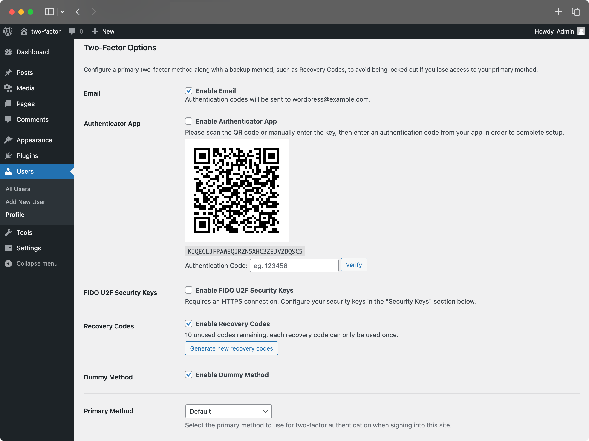
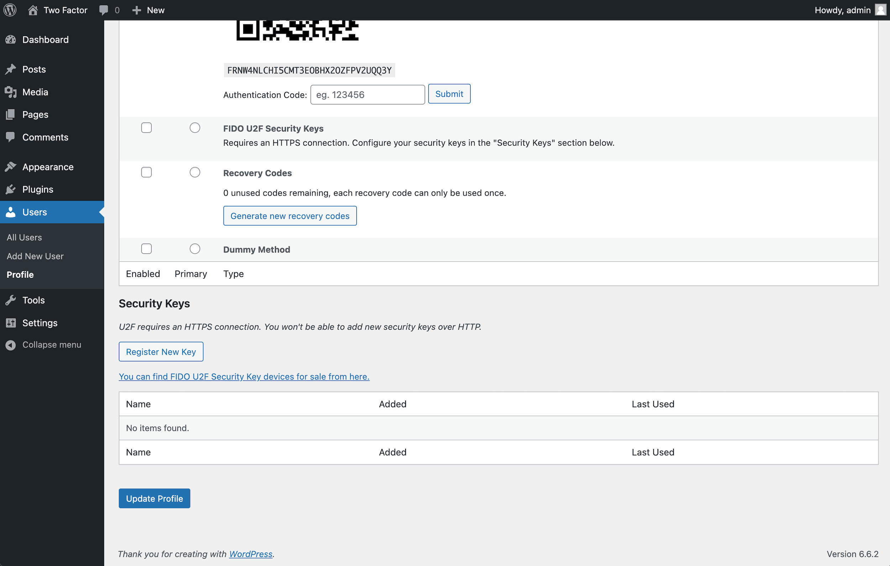
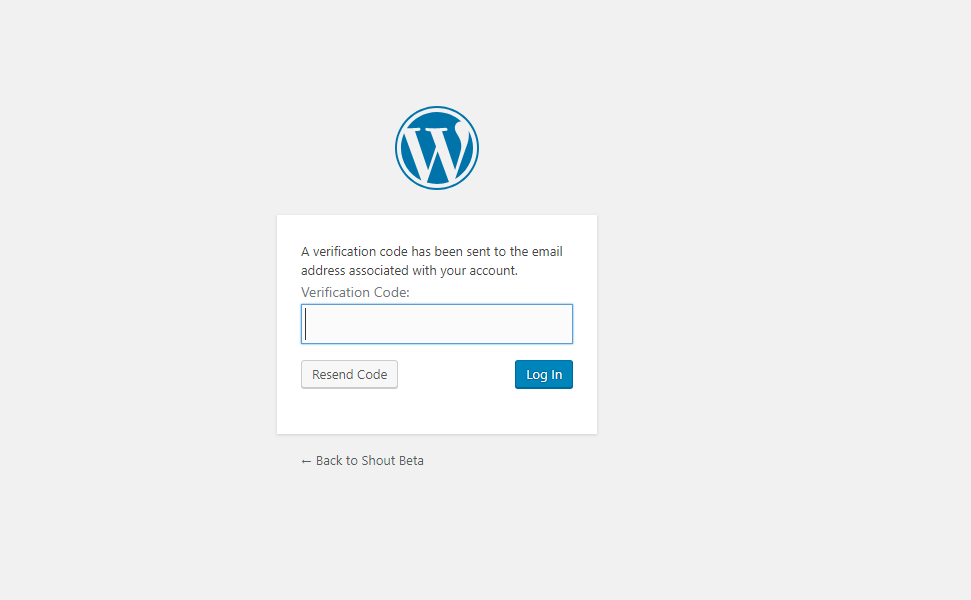

<!-- DO NOT EDIT THIS FILE; it is auto-generated from readme.txt -->
# Two-Factor

Enable Two-Factor Authentication using time-based one-time passwords (OTP, Google Authenticator), Universal 2nd Factor (FIDO U2F, YubiKey), email and backup verification codes.

**Contributors:** [georgestephanis](https://profiles.wordpress.org/georgestephanis), [valendesigns](https://profiles.wordpress.org/valendesigns), [stevenkword](https://profiles.wordpress.org/stevenkword), [extendwings](https://profiles.wordpress.org/extendwings), [sgrant](https://profiles.wordpress.org/sgrant), [aaroncampbell](https://profiles.wordpress.org/aaroncampbell), [johnbillion](https://profiles.wordpress.org/johnbillion), [stevegrunwell](https://profiles.wordpress.org/stevegrunwell), [netweb](https://profiles.wordpress.org/netweb), [kasparsd](https://profiles.wordpress.org/kasparsd), [alihusnainarshad](https://profiles.wordpress.org/alihusnainarshad), [passoniate](https://profiles.wordpress.org/passoniate)  
**Tags:** [two factor](https://wordpress.org/plugins/tags/two-factor), [two step](https://wordpress.org/plugins/tags/two-step), [authentication](https://wordpress.org/plugins/tags/authentication), [login](https://wordpress.org/plugins/tags/login), [totp](https://wordpress.org/plugins/tags/totp), [fido u2f](https://wordpress.org/plugins/tags/fido-u2f), [u2f](https://wordpress.org/plugins/tags/u2f), [email](https://wordpress.org/plugins/tags/email), [backup codes](https://wordpress.org/plugins/tags/backup-codes), [2fa](https://wordpress.org/plugins/tags/2fa), [yubikey](https://wordpress.org/plugins/tags/yubikey)  
**Requires at least:** 4.3  
**Tested up to:** 5.5  
**Stable tag:** trunk (master)  
**Requires PHP:** 5.6  

   

## Description ##

Use the "Two-Factor Options" section under "Users" → "Your Profile" to enable and configure one or multiple two-factor authentication providers for your account:

- Email codes
- Time Based One-Time Passwords (TOTP)
- FIDO Universal 2nd Factor (U2F)
- Backup Codes
- Dummy Method (only for testing purposes)

For more history, see [this post](https://georgestephanis.wordpress.com/2013/08/14/two-cents-on-two-factor/).
### Actions & Filters ###
Here is a list of action and filter hooks provided by the plugin:

- `two_factor_providers` filter overrides the available two-factor providers such as email and time-based one-time passwords. Array values are PHP classnames of the two-factor providers.
- `two_factor_enabled_providers_for_user` filter overrides the list of two-factor providers enabled for a user. First argument is an array of enabled provider classnames as values, the second argument is the user ID.
- `two_factor_user_authenticated` action which receives the logged in `WP_User` object as the first argument for determining the logged in user right after the authentication workflow.
- `two_factor_token_ttl` filter overrides the time interval in seconds that an email token is considered after generation. Accepts the time in seconds as the first argument and the ID of the `WP_User` object being authenticated.

## Screenshots ##

### Two-factor options under User Profile.

### U2F Security Keys section under User Profile.

### Email Code Authentication during WordPress Login.

## Get Involved ##

Development happens [on GitHub](https://github.com/wordpress/two-factor/). Join the `#core-passwords` channel [on WordPress Slack](http://wordpress.slack.com) ([sign up here](http://chat.wordpress.org)).

Here is how to get started:

    $ git clone https://github.com/wordpress/two-factor.git
    $ npm install

Then open [a pull request](https://help.github.com/articles/creating-a-pull-request-from-a-fork/) with the suggested changes.

## Changelog ##

See the [release history](https://github.com/wordpress/two-factor/releases).

